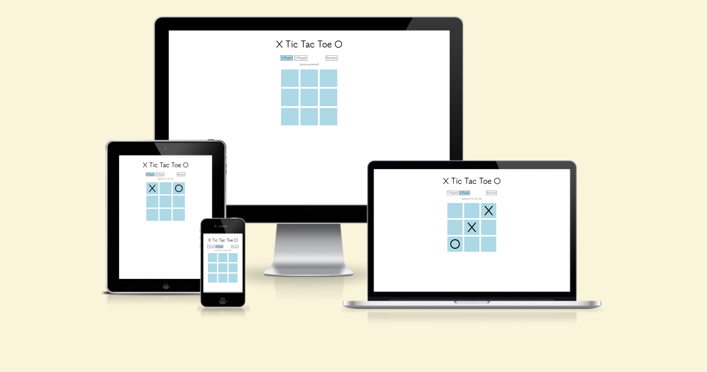
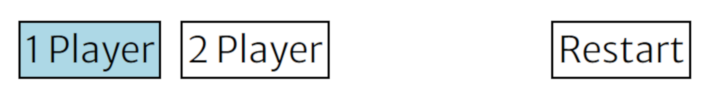
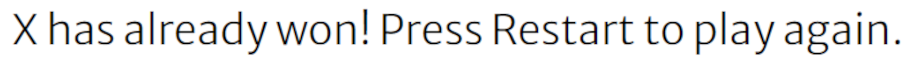
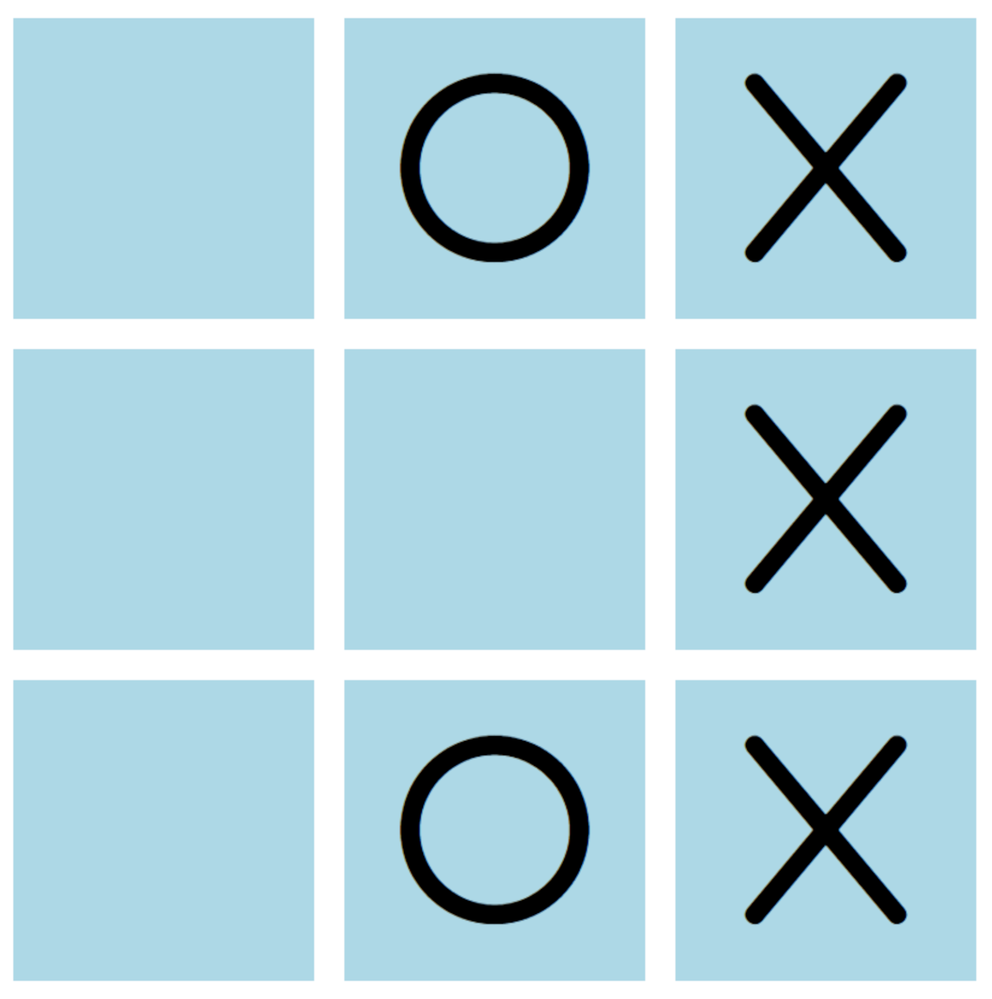
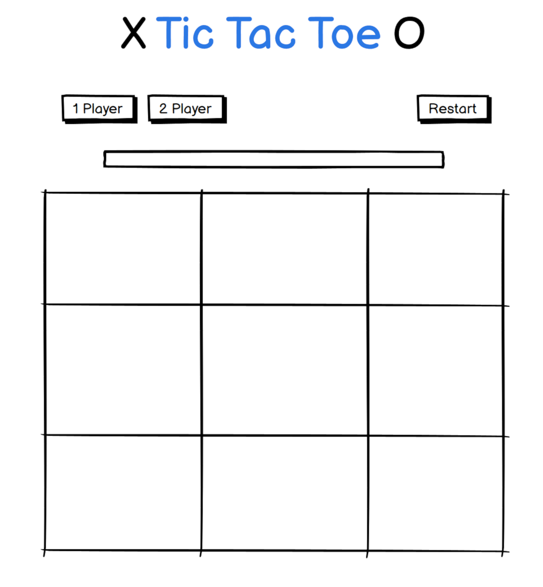
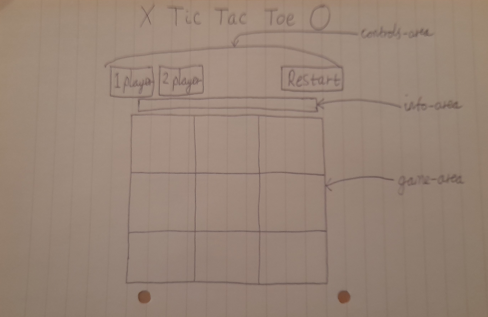
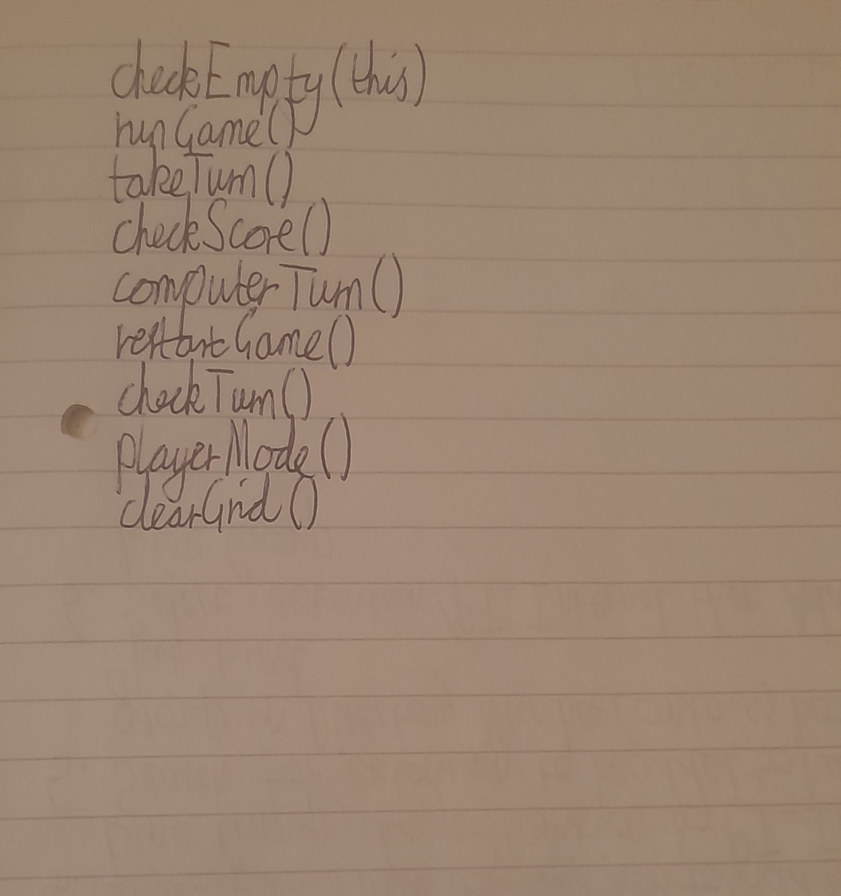
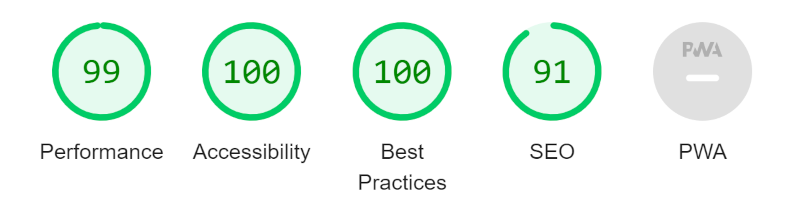

# Tic Tac Toe game

This Tic Tac Toe game is a game that allows people to pass the time while playing the well-known Tic Tac Toe against either the computer, in 1 player mode, or against friends in 2 player mode. It is hoped that users will gain enjoyment from playing and perhaps learn strategies to become a better player when playing against another person. This is aimed at adults and children alike.

## Features 

- __The Tic Tac Toe logo and heading__

  - At the top of the page, above the main game area, the logo and heading is large and the first thing the user will see upon visiting the site, making clear the site's purpose. It features an 'X' to the left of the heading and an 'O' to the right and uses the popular gaming font, Tsukimi Rounded, which is more stylish and design-minded than other fonts.

- __The Controls area__

  - This section contains the controls for the game which allow the user to pick the settings for the game.
  - The controls include the player mode buttons, letting the user choose between playing against the computer and playing against another person they are currently with and the Restart button, which allows the user to start another game without refreshing the page.

- __The Info Bar area__

  - The info bar area displays helpful information to the user regarding the state of the game, such as the outcome of clicking on buttons, the outcome of the game itself and if a game has just been restarted.
  - It is placed directly above the grid, so it is clearly and easily seen by the user.

- __The Grid area__

  - This is the main game area, which consists of a 3x3 grid.
  - When an empty box is clicked, an 'X' or an 'O' is placed into it in accordance with the rules of Tic Tac Toe.
  - The icons for 'X' and 'O' are simple yet stylish and large enough on all screens so the user knows which boxes are empty and which are taken.

### Features Left to Implement

- A feature to allow the user to choose between 'easy', 'medium' and 'hard' difficulties. Only two more algorithms would need to be developed (for the 'medium' and 'hard' difficulties), as 'easy' is already implemented in the computerTurn() function.
- A light/dark (or day/night) mode, allowing the user to switch between a black (or very dark-coloured) background and a white (or very light-coloured) background, depending on their preference or light surroundings.
- An option to allow the user to pick between 'X' and 'O' for their icon.
- A short time space between the user taking their turn and the computer taking its turn, perhaps 200ms or so; it's worth mentioning that an attempt was made at this using the setTimeout() function but this introduced a bug into the game so it was decided to leave it out.

## Design

- A user experience-focused design approach was taken, which included wireframes and sketching out an early interface by hand
- Early functions and a high-level script (featuring the main flow of execution providing the core functionality) were also sketched out

- __Balsamiq mockup__

- __Interface sketch__

- __Early functions__

- __High-level script__

## Testing 

- Thoroughly tested on Chrome, Edge, Firefox, Opera (four of the five most commonly used web browsers(1)).
- Tested on each Windows, Mac and Ubuntu Linux on at least one of the above browsers.
- Site is responsive and functions perfectly on range of different screen sizes, including Galaxy Fold (280 pixels wide), Tablet (768 pixels wide) and Desktop (992 pixels wide), verified using Google Chrome's devtools.
- Heading, button and information bar text all easy to read and understand on Galaxy Fold to desktop screen sizes.
- All buttons work as expected under all conditions (verified by clicking each button in range of different game states).

### Validator Testing 

- HTML
    - No errors were returned when passing through the official [W3C validator](https://validator.w3.org/nu/?showsource=yes&doc=https%3A%2F%2Febl138.github.io%2Ftic-tac-toe%2F)
- CSS
    - No errors were found when passing through the official [(Jigsaw) validator](https://jigsaw.w3.org/css-validator/validator?uri=https%3A%2F%2Febl138.github.io%2Ftic-tac-toe%2F&profile=css3svg&usermedium=all&warning=1&vextwarning=&lang=en)
- JavaScript
    - No errors were found when passing through the official [Jshint validator](https://jshint.com/)
      - The following metrics were returned: 
      - There are 12 functions in this file.
      - Function with the largest signature take 2 arguments, while the median is 0.
      - Largest function has 48 statements in it, while the median is 6.
      - The most complex function has a cyclomatic complexity value of 29 while the median is 3.
- Accessibility
  - Running the site through Devtools' Lighthouse gives the following score and confirms that the colours and fonts chosen are easy to read and accessible

 

### Unfixed Bugs

 - There are no unfixed bugs.

## Deployment

The site was deployed to GitHub pages. The steps to deploy are as follows:
  - In the GitHub repository, navigate to the Settings tab 
  - Under Code and automation on the left side of the page, select Pages
  - Under Branch, select main then Save
  - Github then confirms desployment has been successful and provides the link to view the deployed site

The live link can be found here: https://ebl138.github.io/tic-tac-toe/

## Rationale

### Goals

 - Provide a game with a simple and east to use interface which will be entertaining and enjoyable for the user, whether they are alone (playing against the computer) or with a friend (to play against)
 - Allow the user to choose settings for the game using control buttons

### Target audience

 - The target audience of this site is people who have played Tic Tac Toe before and wish to practise their skills or pass the time
 - The typical target user will aim to improve their Tic Tac Toe skills by playing the game as much as they want, without refreshing the page, and to play themselves or with another person

## Credits 

### Content

- The icons for the 'X' and 'O' were taken from [Font Awesome](https://fontawesome.com/)
- The Love Maths README.md template was used as the basis for this README.md

### Media

- The favicon was generated using the website https://favicon.io/

## Sources

- 1 (most commonly used browsers reference): <https://www.oberlo.com/statistics/browser-market-share>
